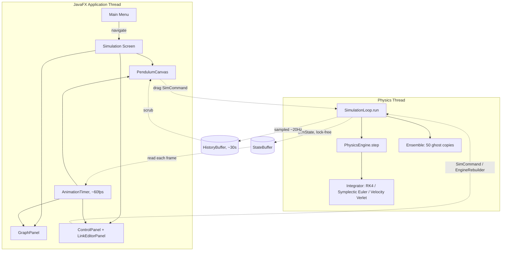

# Dynamics Engine

An N-pendulum chain simulator built in JavaFX for CSE4402 (Visual Programming) — RK4/Lagrangian physics, a lock-free physics thread decoupled from rendering, and a command-driven FXML shell designed to keep growing.

Grab a bob and fling it. Add links live. Turn on the butterfly effect and watch fifty near-identical pendulums fan apart. Scrub back thirty seconds to see what you missed.

## What this actually is

The physics is real: full Lagrangian mechanics for an arbitrary chain of N pendulums (not just the textbook double pendulum), integrated with RK4 by default, verified against closed-form small-angle solutions and energy conservation across N = 1–96. It's fast enough to run 50 extra copies of itself for a live chaos demonstration without dropping frames.

The interaction is real: drag any bob and the rest of the chain reacts through the actual mass-matrix coupling, not a canned animation. Release with a flick and it flings with real angular momentum. Edit any link's length, mass, or initial angle and the simulation rebuilds around it.

## Features

**Simulation**
- Arbitrary N-pendulum chains (runtime-editable, capped at 60 for real-time performance)
- Three swappable integrators — RK4, Symplectic Euler, Velocity Verlet — for direct energy-drift comparison
- Zero heap allocation in the physics hot path; Cholesky decomposition for the (symmetric, positive-definite) mass matrix, with a pivoted Gaussian fallback for near-singular cases
- Direct manipulation: grab, drag, and fling any bob; the rest of the chain responds through real physics
- Frame-stepping, perturbation injection, and a live parameter inspector on hover

**Analysis**
- Six graph modes: angle-vs-time, energy components, phase portrait, small-multiples, Poincaré section, and integrator-drift comparison
- A live, estimated largest Lyapunov exponent while the butterfly-effect ensemble is running
- Time-travel scrubbing through the last ~30 seconds without pausing the live simulation

**Persistence & presets**
- Save/load scenarios as hand-rolled JSON (deliberately not Java object serialization — see [Security notes](#security-notes))
- Six curated presets spanning the classic double pendulum, a near-inverted knife edge, and a 30-link rope

**Accessibility**
- Light/dark theme (the sidebar follows it; see [Architecture](#architecture) for why the canvas doesn't)
- Colour-blind-safe bob palette (Okabe-Ito)
- Reduced-motion mode

## Quick start

Requires JDK 17+ and Maven.

```bash
mvn javafx:run
```

Run the test suite:

```bash
mvn test
```

## Building a native app

```bash
mvn package jpackage:jpackage -Djavafx.jmods.path=/path/to/javafx-jmods-21.0.2
```

Produces a double-clickable `Dynamics Engine.app` (macOS) under `target/installer/` — no Maven or JDK needed on the machine you run it on.

The `javafx.jmods.path` property matters and isn't optional: it must point at an **extracted `javafx-jmods-<version>` directory** — the JMODS SDK distribution, not the Maven `javafx-*.jar` artifacts used everywhere else in this build. Download the one matching your platform from the [OpenJFX downloads page](https://gluonhq.com/products/javafx/) (this project was built and verified against `21.0.2`). Without it, the packaged app fails immediately with `Error: JavaFX runtime components are missing` — confirmed by an actual failed launch during this feature's development, not assumed; see the comments in `pom.xml` for the full explanation of why a classpath-only JavaFX launch needs this.

This only produces an `APP_IMAGE` (a runnable folder), not a signed `.dmg`/`.msi`/`.deb` — those need per-OS signing credentials this project has no reason to hold.

## Architecture



Two threads, one lock-free handoff: the physics thread integrates at a fixed 2ms timestep regardless of render rate, publishing immutable `SimState` snapshots through an `AtomicReference`. The JavaFX thread never blocks waiting on physics, and physics never waits on rendering.

Every mutation from the UI thread goes through one of three explicit channels — never a direct field write across threads:
- **`SimCommand`** — mutates the current engine in place (gravity, a dragged link's angle, perturbation). Applied atomically between RK4 steps.
- **`EngineRebuilder`** — replaces the engine outright (edited link count, length, or mass). A structural edit needs new array sizes, not a field mutation.
- **Frame-stepping** — a fourth, narrower mechanism (an `AtomicInteger` counter) specifically for advancing exactly one step while paused.

**Why the sidebar follows the theme toggle but the canvas doesn't:** `ControlPanel` and `LinkEditorPanel` are ordinary JavaFX controls styled through `theme.css`'s token system, so the same light/dark toggle that themes the menu reaches them for free. `PendulumCanvas` and `GraphPanel` draw raw pixels via `GraphicsContext` — there's no CSS cascade to plug into, so their color choices are direct Java calls. That split is a deliberate architectural boundary (UI chrome themed, rendered physics not), not an oversight.

### Package layout

```
app/            Entry point (thin — just boots the router)
navigation/     SceneRouter, Route enum, Navigable interface
controller/     One controller per FXML screen
component/      Reusable FXML components (NavCard)
ui/             Canvas-drawn views: PendulumCanvas, GraphPanel, ControlPanel, LinkEditorPanel
physics/        PhysicsEngine, PendulumConfig, SimState, persistence, presets
physics/integrator/  Swappable integration strategies
simulation/     SimulationLoop (the physics thread), StateBuffer, HistoryBuffer, Ensemble
simulation/command/  SimCommand, EngineRebuilder, and their implementations
theme/          Theme, ThemeManager (also home to the two accessibility preferences)
config/         Central app constants
```

## Performance

Benchmarked on the project's own hardware (uniform links, `dt = 0.002`):

| N | steps/sec | real-time headroom |
|---|---|---|
| 2 | ~1.9M | ~3900× |
| 8 | ~377,000 | ~750× |
| 32 | ~24,000 | ~48× |
| 64 | ~5,100 | ~10× |
| 96 | ~800 | ~1.6× |

Energy drift stays below 0.5% over 10 simulated seconds across N = 1–20 (see `EnergyConservationTest`). The Cholesky-based solver and allocation-free hot path roughly doubled throughput over an earlier Gaussian-elimination version in the mid-N range — this is what makes running a 50-member butterfly-effect ensemble alongside the primary simulation affordable at N=2–3: even fully loaded, it costs a low single-digit percentage of one core.

## Testing

28 tests across 6 classes, all in `physics/` — the engine's correctness is what's tested, not the Canvas rendering (which, like most JavaFX UI code, isn't practically unit-testable without a running toolkit):

- **`AnalyticComparisonTest`** — small-angle motion against closed-form simple harmonic motion; period scaling with `√L`
- **`EnergyConservationTest`** — drift bounds across N = 1, 2, 3, 5, 8, 12, 16, 20
- **`RobustnessTest`** — near-zero mass, near-inverted start, N=60 (the UI's own ceiling)
- **`IntegratorSwitchingTest`** — all three integrators stay finite and bounded; switching mid-run doesn't corrupt state
- **`PendulumConfigIOTest`** — round-trip fidelity, and explicit rejection of truncated JSON, mismatched arrays, oversized N, oversized files, and non-finite values
- **`PhysicsEngineSmokeTest`** — the original scaffolding: rest-at-equilibrium, basic conservation, `setLinkState`, NaN rejection

## Security notes

Scenario files are hand-rolled JSON (`PendulumConfigIO`, `MiniJson`), not Java's `ObjectOutputStream` — deserializing an untrusted file through native Java serialization is a well-known remote-code-execution vector. A flat JSON object with five known fields has no such surface: the worst a malicious file can do is fail to parse or fail `PendulumConfig`'s own validation.

Two independent bounds apply before any file content is trusted: raw file size is capped (1MB) before parsing even begins, and N is capped (500) before any array sized by it is allocated.

## Known limitations

- The simulation canvas doesn't follow the light/dark theme toggle (see [Architecture](#architecture) for why, and what would be needed to change it)
- Time-travel scrubbing is a *view* into recent history, not a rewind of the live engine — releasing the scrub slider returns to the live simulation exactly where it already was, rather than resuming from the scrubbed point
- Velocity Verlet's implementation is a documented approximation for this system's velocity-dependent acceleration; it doesn't carry the accuracy guarantee classic Verlet has for velocity-independent forces (see `VelocityVerletIntegrator`'s javadoc)
- The Lyapunov estimate is a simplified two-trajectory divergence measurement, valid for the short initial-divergence window before ensemble members saturate — not a rigorous Benettin-method estimate with periodic renormalization

## Course context

Built for CSE4402 (Visual Programming). See `git log` for the incremental build history — the project moved from a single-file JavaFX prototype through an FXML/MVC shell, direct-manipulation physics, a verified test suite, and the analysis/persistence features above.
