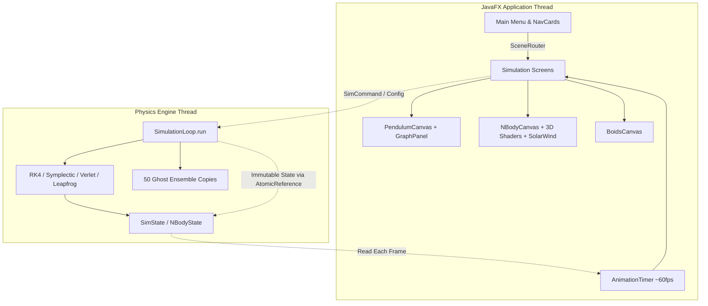

# Dynamics Engine

An interactive dynamical systems and computational physics laboratory built in JavaFX for CSE4402 (Visual Programming) — featuring Lagrangian mechanics, Newtonian orbital gravity, magnetohydrodynamic solar wind, and emergent flocking, powered by decoupled lock-free physics threads and a modular FXML shell.

Explore chaotic multi-pendulum chains, fly through a 34-body solar system with procedural planetary atmospheres and magnetic flux tubes, or guide flocking boids past predators in real time.

---

## The Simulations

The suite currently features three full-fidelity dynamical systems:

### 01 — N-Pendulum Chain
* **The Physics:** Full Lagrangian mechanics for an arbitrary chain of $N$ coupled pendulums ($N = 1 \dots 60+$), integrated with RK4 by default, verified against closed-form small-angle solutions and energy conservation across $N = 1\text{–}96$.
* **Interaction:** Grab, drag, and fling any bob with real angular momentum transfer through the mass-matrix coupling. Edit link lengths, masses, or initial angles on the fly.
* **Chaotic Ensembles:** Run 50 ghost copies simultaneously to demonstrate the butterfly effect with live Lyapunov exponent estimation.
* **Analysis & Visualization:** Six live graph modes (angle vs. time, energy components, phase portrait, small-multiples, Poincaré section, and integrator drift), plus bifurcation/Poincaré analysis.
* **Time-Travel Scrubbing:** Inspect the last ~30 seconds of history without halting live physics.
* **Audio Sonification:** Real-time synthesizer (`audio.Sonifier`) mapping kinetic and potential energy fluctuations into dynamic soundscapes.
* **Natural Language Scene Generation:** Built-in parser (`NaturalLanguageSceneParser`) that constructs complete pendulum scenarios from plain English prompts (e.g., *"a 4-link pendulum with heavy bottom bobs"*).

### 02 — N-Body Gravitational Dynamics
* **The Physics:** Softened Newtonian gravitational $N$-body engine tracking position, velocity, and mass across arbitrary celestial systems with symplectic leapfrog and adaptive integration.
* **Solar System Preset:** Authentic 34-body configuration including the Sun, all 8 major planets, dwarf planets, and major moons with scaled orbital parameters.
* **Photorealistic 3D Celestial Rendering:** Hardware-accelerated 3D sphere meshes with authentic procedural astronomy shaders and texture management for planetary surfaces (Sun, Earth, Jupiter, Saturn with procedural particle rings, Mars, etc.).
* **Planetary Magnetospheres & Dipole Fields:** Rigorous dipole magnetic field mathematics (`DipoleFieldMath`) with real-time vector field evaluation, field presence determination, and magnetopause standoff distance calculation (`MagnetopauseCalculator`).
* **Solar Wind & Coronal Mass Ejections (CME):** Interactive Parker spiral magnetic flux tubes and solar wind particle dynamics with interactive CME triggers and bow shock deflections around magnetized planets.
* **Conservation & Time Symmetry:** Rigorously verified conservation of total energy, linear momentum, and angular momentum, along with reversible integration.

### 03 — Boids Flocking
* **Emergent Behavior:** Craig Reynolds' classic flocking model implementing separation, alignment, and cohesion.
* **Predator-Prey Interactions:** Interactive predators that dynamically scatter flocks and alter emergent cluster topology.
* **Spatial Optimization:** Efficient spatial partitioning for smooth real-time simulation of large boid populations.

---

## Features & Highlights

* **Architecture:** Lock-free physics threads decoupled from JavaFX rendering loops via atomic handoff buffers (`StateBuffer`), ensuring consistent physics timesteps regardless of display refresh rate.
* **Navigation & UI:** Modern card-based landing hub (`MainMenu`) with animated hover expansion revealing detailed feature blurbs and live simulation preview screenshots.
* **Customization & Accessibility:**
  - Full Dark/Light theme support via centralized CSS tokens (`theme.css`).
  - Color-blind-safe palettes (Okabe-Ito).
  - Reduced-motion mode for accessibility.
* **Presets & Persistence:** Hand-rolled JSON scenario persistence with strict bounds checking (no vulnerable Java native object serialization).

---

## Quick Start

### Prerequisites
- **JDK 17+**
- **Maven 3.8+**

### Launching the Application

```bash
mvn javafx:run
```

### Running the Test Suite

```bash
mvn test
```

The automated test suite runs **116 tests across 27 classes**, covering:
- Energy, linear momentum, and angular momentum conservation
- Small-angle analytic comparison and period scaling
- Time-reversal symmetry
- Numerical integrator stability (RK4, Symplectic Euler, Velocity Verlet)
- Celestial dipole magnetism and magnetopause standoff calculations
- Natural language scene parsing
- Audio sonification and UI component lifecycle

---

## Building a Native App

```bash
mvn package jpackage:jpackage -Djavafx.jmods.path=/path/to/javafx-jmods-21.0.2
```

Produces a standalone, double-clickable `Dynamics Engine.app` (macOS) under `target/installer/` — no Maven or JDK required on target machines.

> [!IMPORTANT]
> The `javafx.jmods.path` parameter must point to an extracted **JavaFX JMODs SDK distribution** (e.g., `javafx-jmods-21.0.2`), available from [Gluon OpenJFX](https://gluonhq.com/products/javafx/). Standard Maven JARs are not sufficient for `jpackage` bundling.

---

## Architecture



Two threads, one lock-free handoff: the physics thread integrates at a fixed timestep regardless of render rate, publishing immutable snapshots through an `AtomicReference`. The JavaFX thread never blocks waiting on physics, and physics never stalls waiting on rendering.

### Package Layout

```
app/                 Application entry point and lifecycle bootstrap
audio/               Real-time physical audio sonification (Sonifier)
component/           Reusable UI components (NavCardController with preview screenshots, UtilityIconButton)
config/              Central application constants and configuration
controller/          FXML controllers (MainMenu, Simulation, NBodySimulation, Boids, Manual, Settings, About)
navigation/          Scene routing architecture (SceneRouter, Route, Navigable)
physics/             Core physics engines (Lagrangian PhysicsEngine, Bifurcation, NaturalLanguageSceneParser, etc.)
physics/integrator/  Numerical integration strategies (RK4, Symplectic Euler, Velocity Verlet)
physics/io/          JSON scenario persistence and validation
physics/nbody/       N-body gravitational solver, DipoleFieldMath, MagnetopauseCalculator, Presets
simulation/          SimulationLoop, StateBuffer, HistoryBuffer, Ensemble
simulation/command/  Thread-safe UI-to-physics commands and engine rebuilders
theme/               Theme tokens, ThemeManager, accessibility toggles
ui/boids/            Boids canvas renderer
ui/icon/             Hand-rolled Canvas vector icon glyphs
ui/nbody/            3D celestial models, shaders, planetary textures, solar wind & flux tube renderers
ui/pendulum/         Pendulum canvas renderer, multi-mode graph panel, link editors
ui/simcore/          Shared simulation controls, action rails, logarithmic sliders
```

---

## Security Notes

Scenario files use custom minimal JSON parsing (`PendulumConfigIO`, `MiniJson`), completely avoiding Java's native `ObjectOutputStream` / `ObjectInputStream` deserialization vulnerabilities. Input files are bound by strict size limits (1 MB) and element bounds ($N \le 500$) before memory is allocated.

---

## Academic & Course Context

Developed for **CSE4402 (Visual Programming)**. See `git log` for the complete incremental implementation trajectory — from an initial prototype through advanced multi-body physics, astronomical field dynamics, and reactive UI architecture.
